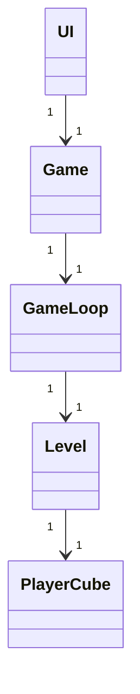

# Arkkitehtuurikuvaus

## Sovelluslogiikka

Luokkakaavio sovelluksen tärkeimmistä luokista. GameLoop-luokka pyörittää peliä ja käsittelee näppäinpainallukset ja tason uudelleenkäynnistyksen, Level luokka käsittelee mm. spritejen liikkumisen.


## Toiminnalisuus

GameLoop-luokka rekisteröi pelaajan syötteen, Level-luokka siirtää pelaajan hahmoa. Jos pelaaja pääsee maaliin palautuu True, ja pelaaja pääsee seuraavaan tasoon

```mermaid
sequenceDiagram
    actor User
    participant UI
    participant Game
    participant GameLoop
    participant Level
    participant PlayerCube
    
    User ->>+ UI: start application
    UI ->>+ Game: start game
    Game ->>+ GameLoop: start gameloop
    GameLoop ->>+ Level: press k_left, k_right, k_down, k_up
    Level ->>+ PlayerCube: move_cube
    PlayerCube -->>- Level: True
    Level -->>- GameLoop: True 
    GameLoop -->>- Game: True
    Game -->>- UI: exit game
    UI -->>- User
```
